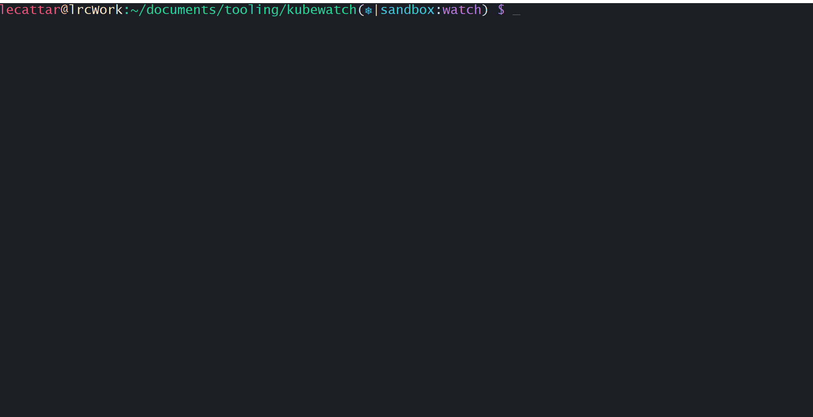

# kubectl-watch :eyes:

[Kubernetes CLI plugin](https://kubernetes.io/docs/tasks/extend-kubectl/kubectl-plugins/) for better resource watching output.



## Installation

```bash
git clone https://github.com/lee0c/kubectl-watch.git
cd kubectl-watch
chmod +x kubectl-watch
ln -s /path/to/kubectl-watch/kubectl-watch /usr/local/bin/kubectl-watch
```

You can then run `kubectl plugin list` to confirm that this is available as a kubectl plugin, and use `kubectl watch ---` as a kubectl command.

## Use

`kubectl watch` will take any arguments `kubectl get` takes. It additionally adds a few options which **must be specified before any standard kubectl arguments**. Arguments that require values are shown with their default value.

| Options |  |
| :------ | --- |
| -c, --calls 60 | Make 60 calls before exiting (pass 0 to disable progress bar/exiting) |
| -s, --sleep 1 | Sleep for the specified number of seconds between calls |
| -h, --help | Displays help text. |

## Notes

By default, this uses UTF-8 characters in the progress bar. It should switch to standard ANSI characters if your terminal doesn't support UTF-8, but if you're having issues with it try using the `--simple` flag - and [put in a :bug:](https://github.com/lee0c/kubectl-watch/issues)